## 目录

[TOC]

## 0、常见 Q&A

**Q：本文档的组成部分？**

A：整体以实操为主，从创建一个可以增删改查的视图开始，到实现一条业务流程。另外，文档无法做到事无巨细的进行阐述，因此需要发挥主观能动性多进行尝试。

**Q：本文档的有效期限？**

A：本文档撰写于2025-03-21。目前JIT及相关的系统仍处于快速迭代中，本文档中内容随时可能变动，但整体思路基本已固定。

**Q：为了实现我的业务系统，我需要在什么平台进行设计？**

A：几乎全程都是使用JIT进行。

**Q：使用JIT可以做到只需业务人员就可以开发系统？**

A：理想情况下可以，但每个项目的前中期无可避免需要定制一些动作（代码）来解决问题。

**Q：【技术向】如果我需要使用代码进行定制化开发，我需要准备什么环境？**

A：具体在另外一篇文档中解释。主要使用*Eclipse*配合插件*BapDeveloper_Debug_1.X.X.jar*，其中插件具备对代码的管理以及对工程的管理相关功能。此外，开发也可使用*IDEA*进行开发，只是插件本身不支持*IDEA*。

**Q：【技术向】我看到生成的界面总是一样的风格，是否可以定制页面？**

A：可以。后续可使用JDF（Java Driven Flutter）进行定制页面，可参考文档*《深入浅出JDF（Java Driven Flutter）》*。

**Q：【技术向】我的需求中要求特殊的显示效果，但基于JIT似乎无法做到，如何解决？**

A：同上，可基于JDF开发对应的组件。

## 1、创建工作空间

> [!NOTE]
>
> 当环境中同时进行多个项目的开发和管理时，可通过工作空间功能将它们明确分隔开来，以确保各项目之间互不干扰。通过工作空间的设置，用户可以创建不同的工作区域，其中每个工作空间都专注于一个特定的项目或任务，包括独立的配置、存储和工作内容。这种方式有助于保持项目间的独立性，避免混淆和混乱，提高工作效率和管理灵活性

进入JIT后，点击添加按钮便可见下图。

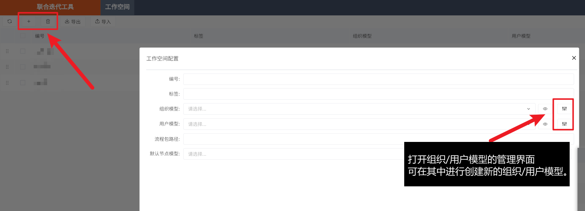

其中，要填的属性如下：

- **编号**，工作空间的编号，一般可用项目的英文名称或拼音首字母。
- **标签**，工作空间的中文名称。
- **组织模型**，指当前工作空间使用哪一套组织架构。
- **用户模型**，指当前工作空间使用哪一套用户体系，不同用户体系之间隔离。

其中**组织/用户模型**需要点击右侧的管理按钮，在**组织/用户模型树**的根节点点击新增，可见下图：

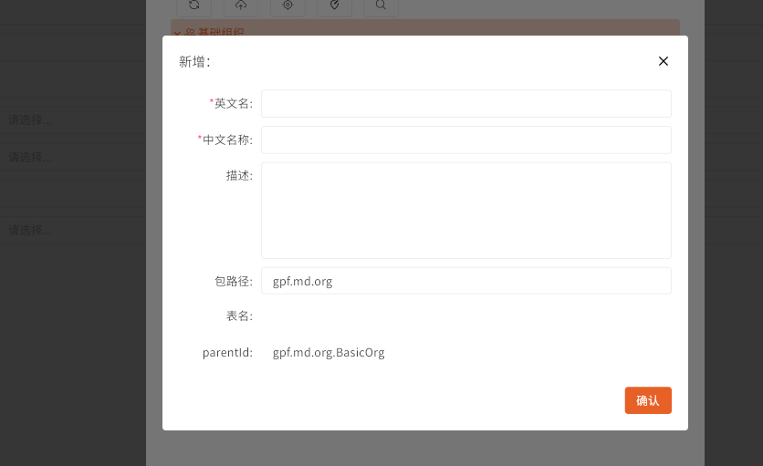

添加后，设置为当前工作空间的**组织/用户模型**即可。

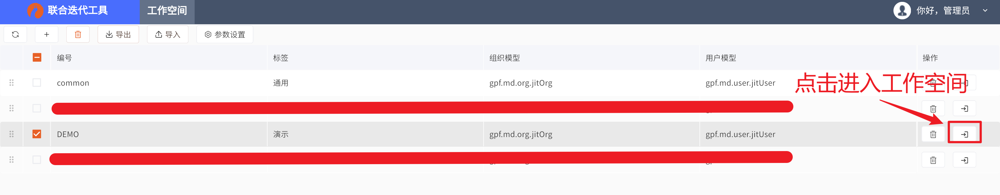

当全部设置完毕后，可以单击表格行最右侧的按钮，进入工作空间。

补充：

**基于组织/用户模型，我们后续最为常见的一种需求是：我们可能会提供一种机制，做到不同部门对于某个数据拥有不同的权限。**

我们可以在JIT中进行创建子组织/角色，以及将某个用户添加到某个角色下。

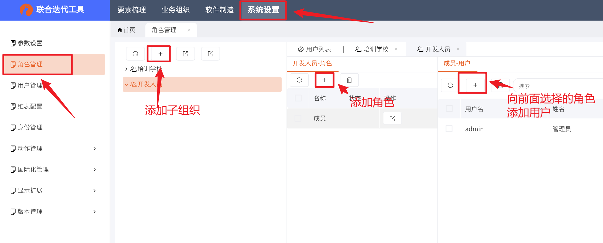

## 2、增加一个视图
### 2.1、数据模型

> [!NOTE]
>
> 数据模型是一种用来描述数据、数据关系、数据操作以及数据约束的概念模型。它提供
>
> 了对数据结构、数据元素之间的关系以及数据操作的抽象描述，帮助人们理解数据的组织方
>
> 式和数据之间的关联。

从实操入手，定义 **数据模型 = 为了实现某个目标，有哪些信息需要展示**。而为了展示不同表现形式的信息，数据模型分为以下几种类型：文本、布尔值、整数、小数、时间、附件、关联、嵌套模型。还有一些特殊的：密码、嵌套关联、属性表。

其中大部分类型从自身名称便可知道其含义，主要需要解释的是关联和嵌套模型。

#### 2.1.1 基础类型

在现阶段版本的JIT中，主要有以下六种类型。

- 文本（字符串）

- 时间（系统底层会存储为时间戳）

- 整数

- 小数

- 布尔值（true / flase）

- 附件（附件也可以作为一个属性被“数据表”进行维护，后续可以直接通过这个属性拿到文件的二进制数据）

  这个比较简单，便不再详细解释。

#### 2.1.2 关联模型

***关联**：声明自己与另外一个数据模型之间存在关系。*

从实操中解释，现有*培训班模型*，*学生模型*，在现实生活中我们想声明班级和学生之间的联系，我们需要一系列的表格、档案进行存储，在数字空间也是相同。

因此我们的*培训班模型*必须要增加一个属性名为"学生列表”，并将其设置为"关联多选”。关联多选的语义是，所产生关系的另外一个模型可能与其产生关系的数据是大于1的，即一个班级不可能只有0或1个学生。

下图为常见的关联属性的表现形式，一般作为一个下拉框，见*"课程类别”*：

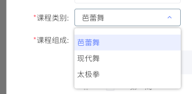

#### 2.1.3 嵌套模型

***嵌套：**在关联的基础上，声明对方数据完全归属于自己，更强调信息属于自己的附属数据。*

回到关联的例子，学生与培训班两者之间的关系实际上更像是一种平等的关系，学生在物理意义上不属于培训班，培训班在物理意义上亦不属于学生，因此当在培训班模型中移除一条学生的数据，我们会意识到学生仍然存在，同样的，当我们移除一条学生的数据，培训班也依旧存在，只是他们互相的关系被我们斩断了。

那么嵌套模型与其不同，被嵌套的模型与进行嵌套的模型是严格绑定的，因此培训班和学生的例子便不再适用，我们使用"*博客文章与评论*”为例，进行解释。

当一篇博客文章发布后，会出现一堆的评论，假设我们要对这篇文章进行管理，我们发现：

1. 评论是严格归属于文章的
2. 删除文章中的某个评论，评论将会消失
3. 删除文章后，文章所有的评论都会消失

下图为常见的嵌套模型属性的表现形式，一般作为一个表格，见"*课程组成*”：

#### 2.1.4 在JIT中创建

那么如何在JIT中操作，创建数据模型呢？

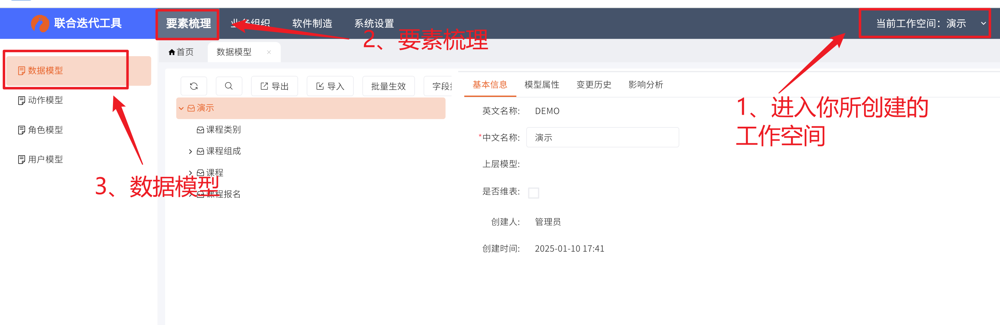

当进入数据模型界面的时候，会显示一个数据模型树以及被点击模型的详细信息界面，当工作空间正常创建后，会自动创建一个与工作空间同名的根节点，如上图的“演示”。

见上图，演示节点的右侧有一个新增按钮，当我们单击便可以打开新建数据模型的对话框，而在这个对话框中所创建的数据模型，系统会将认为它是“演示”节点的子节点。同时，在单击某个节点的时候，可以选择顶部的“导入”和“导出”按钮，会将当前节点的数据模型导出为Excel，我们可以在Excel中进行填写。不过，如果我们导入Excel，那么这个Excel中的数据模型会基于所录入的“上层模型”进行判断其父节点，Excel的结构可见下图。不过下图中的“课程”的上层模型为空，主要原因是这个模型的上层模型就是根节点，因此无需录入，加入课程下有子节点，那么这个子节点的上层模型便是“课程”。

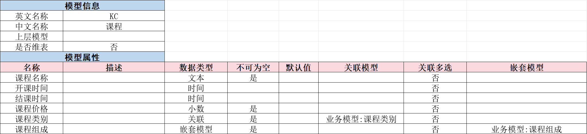

**同时，我们也可以看到，当我们录入基础类型的时候，其中数据类型简单填写进去就好，如上图的【文本、时间、小数】，但是关联和嵌套模型便不太相同**，它们在表格列的【关联模型、嵌套模型】还分别填写了【业务模型:课程类型】以及【业务模型:课程组成】。

这两列的主要目的是补充关联和嵌套的信息，因为前面声明了这个属性是关联/嵌套的，那么你关联哪个表和？嵌套哪个表呢？可以通过这两列进行补充说明，而具体的格式便是：【业务模型:XXX模型名称】。其中冒号是英文，不要填错了。

### 2.2、视图配置

在JIT的"软件制造 > 视图配置”中，我们可以对视图进行设置，如下图可将已有的视图配置进行导出为Excel，如果不勾选已有的，则会导出默认模板。

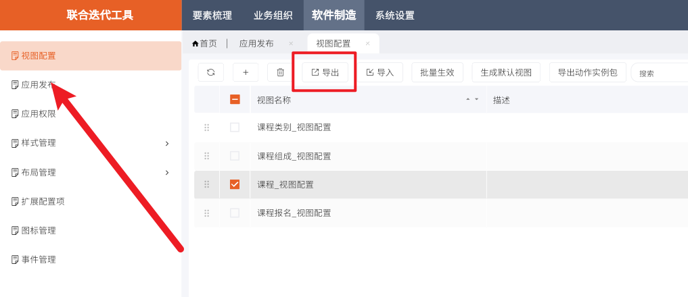

#### 2.2.1、EXCEL配置

对于视图，我们一般可以通过视图对应的Excel模板进行配置，主要需要配置的页面有：

1. **基础设置**，对视图要展示的信息进行描述，如表格有多少列？表单有哪些字段？
2. **扩展配置**，对视图对应的相关逻辑进行描述，如有什么按钮？按钮对应什么动作？

##### 2.2.1.1 基础设置

> [!NOTE]
>
> 对于"样式”相关的设置，参考"**2.2.3、样式设置**"内容。

由以下结构进行组成：

- **视图信息**

主要的属性是视图的名称，一般由"xxx_视图配置"组成。而数据来源，则是对应到某个数据模型，指该视图对应这个数据模型。

- **电脑端表格配置**

表格有哪些列，一些是否选项。

- **移动端列表配置**

同表格配置，只是移动端多是用卡片进行组织，而非列表，因此属性不同。

- **表单配置**

对于表单各项进行配置。

##### 2.2.1.2 扩展配置

> [!IMPORTANT]
>
> 动作（Action）表示**行为的最小可执行单元**（不可再分解的原子操作）。用于描述系统中的具体行为步骤，在本系统中一般在视图触发某段需要代码介入的自定义逻辑中使用动作。
>
> 而动作模型（Action Model）是指未进行实例化的动作，需要配置其参数，从而得到动作（实例），我们才能进行使用。

下面是扩展配置中的一些配置项：

- **按钮定义**

定义界面上有哪些按钮，在什么表格上还是表单上？如果点击了这个按钮应该会发生什么（填写动作名称）？

- **动作定义**

本视图有哪些动作，这个动作叫什么，这个动作对应哪个动作模型。

- **监听事件**

对视图的一些事件进行绑定，比如我们可以通过该项配置，当表单进行初始化的时候，我们可以响应我们自定义的表单初始化动作，以此控制表单字段的显示和隐藏，抑或对值进行填充、修改。

- **定时器**

设置执行间隔后视图会定时执行某个动作。

- **布局定义**

填写当前视图对应哪个布局数据，一般情况下使用"xxx_表单布局”作为名称，后续在JIT的"软件制造 > 布局管理”中进行调整。

- **扩展配置**

配置一下视图的默认设置，具体的配置项可见于Excle的第四页"配置项说明”。

##### 2.2.1.3 导入Excel并生效

如下图所示，当视图配置导入系统后，应该再次勾选，并点击"批量生效”，即可将视图配置转换为真正的视图。

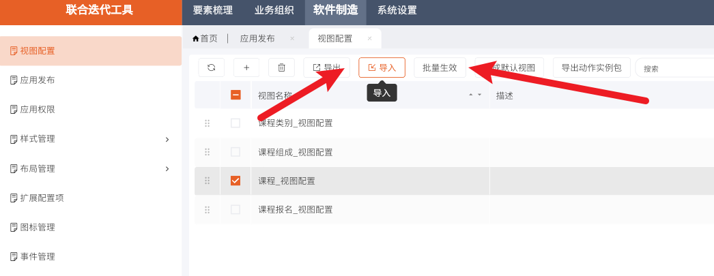

#### 2.2.2、布局设计

当Excel编写完整的时候，系统会自动创建对应的布局数据，可在"软件制造 > 布局管理”中找到，如果无法找到则重新阅读*2.2.1.2 扩展配置*。

一般大量操作都是调整"电脑端/移动端表单布局”，见下图，单击后可进入布局调整页面。

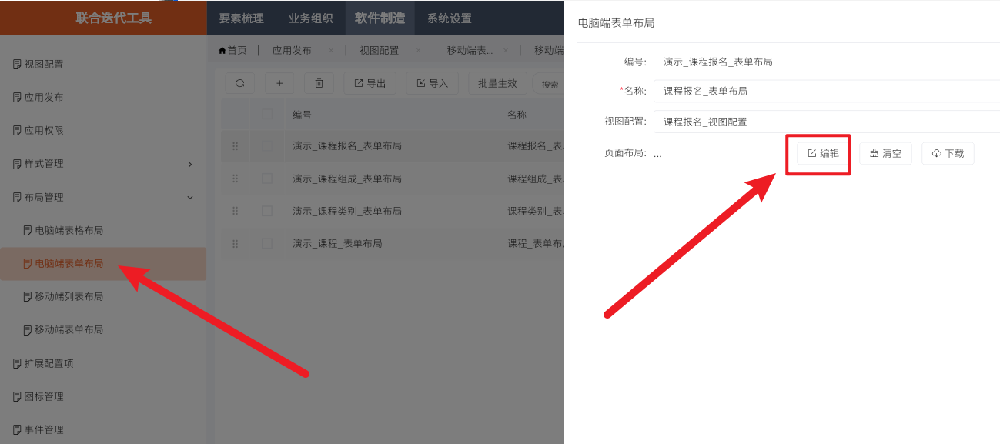

如下图，左侧有"布局”、"组件”。前者可使用常见的布局工具对组件进行调整，后者可找到我们视图配置中填写的属性和按钮。具体操作不进行表述，可实操查看。**调整好后点击右下角的"确定”退出并保存当前的布局数据，之后点击"生效”，便可将最新的效果同步到布局对应的视图中。**

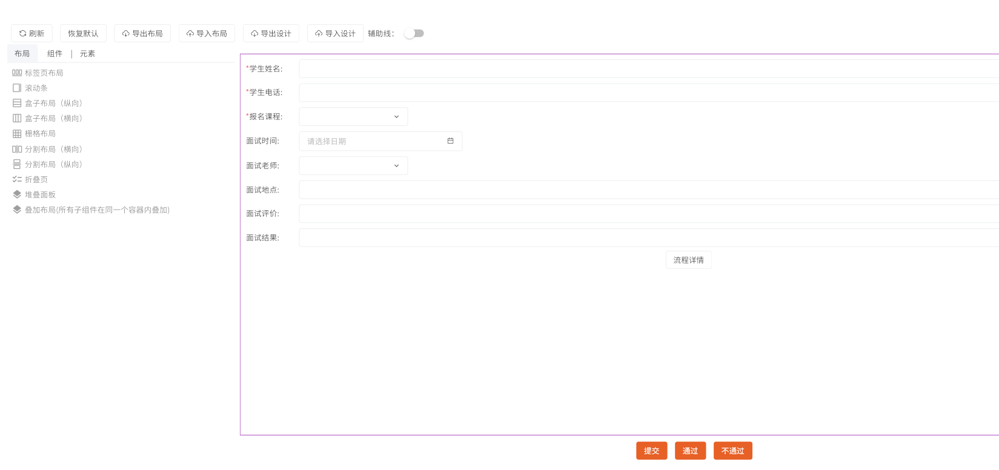

#### 2.2.3、样式设置

**在视图中，无论是表单的属性还是表格列，总是见到"电脑端样式”、"显示样式”、"搜索样式”，其含义是给与默认属性不同的展示效果。**总之，如果想要不同的展示效果，就应该第一时间想到样式，如果当前系统内置的样式无法做到想要的效果，则需要我们自己进行开发。

比如同样是文本类型的字段，那么我的需求就是让这个文本类型变成长文本格式，比如让它默认就显示六行，亦或是我想让某个嵌套模型表格使用我自己对应的视图（默认情况下嵌套模型到表格会将对应模型到所有列都渲染出来，这个时候我们就需要使用我们自己的视图）。

综上，这个时候我们需要在对应的样式单元格上写"字段名_xx表现形式”，如下图：

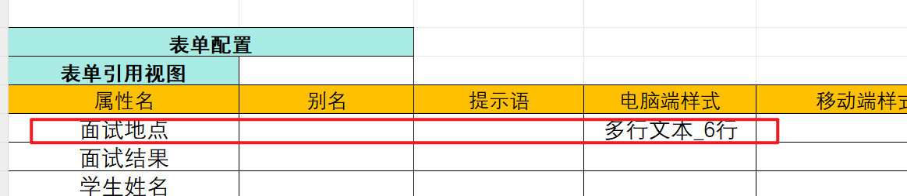

那么，当该视图生效后，可在"软件制造 > 样式管理 > 表单属性样式”中看到，而**想要配置这个样式的不同显示策略，需要点击"显示扩展”的编辑按钮。**另外，注意，下图需要先为这个样式设置"属性类型”。

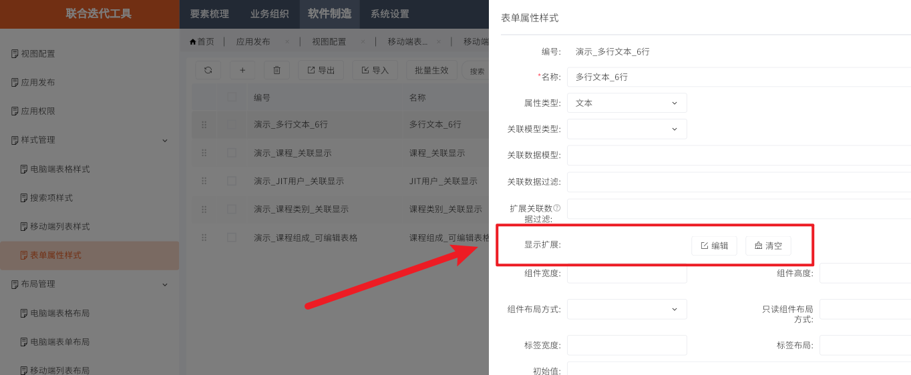

点击后见下图，选择"多行文本”，然后填写对应的属性进行配置即可。

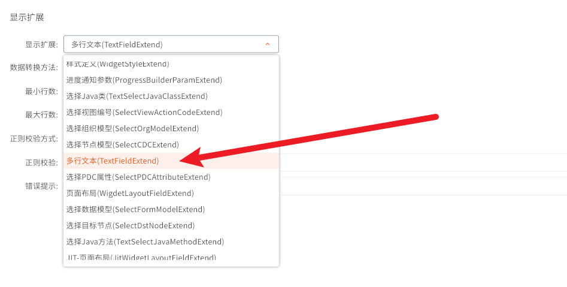

可见下图效果：

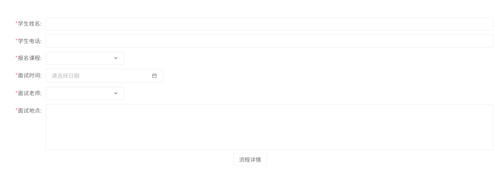

### 2.3、发布应用

> [!TIP]
>
> 对于**组织/用户模型**相关的信息，可回顾*1、创建工作空间*

当构建出我们需要的视图的时候，可以将这些视图组织为一个应用，可见于"软件制造 > 应用发布”。

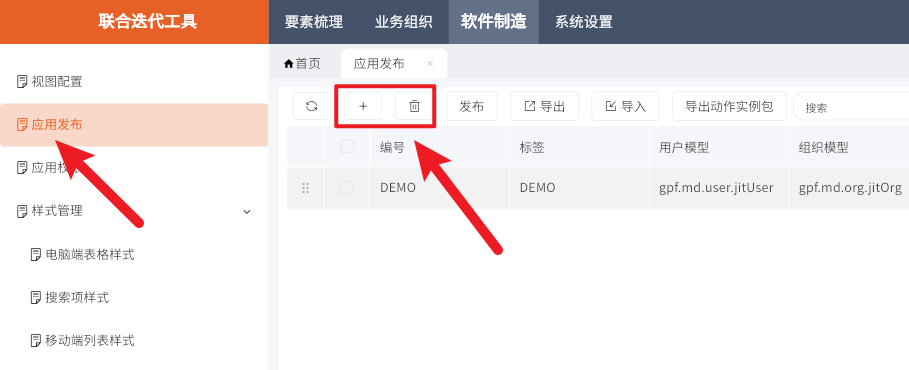

应用的配置项中（见下图），经常使用的类别如下：

- **目录管理**，管理当前应用有哪些菜单，哪些目录，哪些视图。
- **主题样式**，对当前样式进行配置，可进行定制"登录页”、"首页”，亦或者根据不同角色区分不同首页。
- **权限配置**，管理当前应用菜单的相关权限，可以根据角色的不同展示不同的菜单项。
- **其他配置**，限制当前用户使用哪一套"用户模型”和"组织模型”。

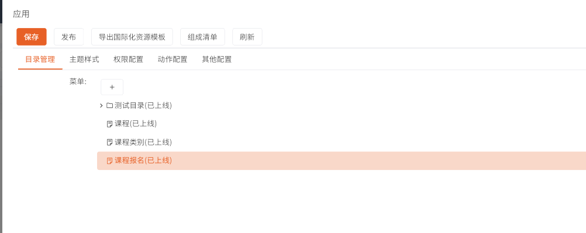

综上，配置完毕后点击"保存”按钮，然后再点击"发布”按钮。

## 3、设计一个业务流程

业务流程与前述视图配置相同，一般采用Excel的方式进行编辑，其中**导入\导出操作**，可见于下图（"业务组织 > 流程组装”）。

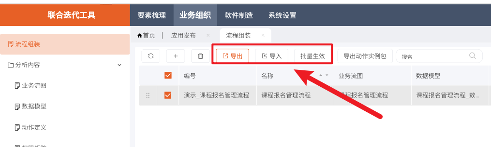

逻辑与视图配置相同，当不勾选的时候可以导出一份模板。最终模板可见以下几个需要编写的页面：

- **流程组织**，描述这条流程有哪些节点，以及描述节点之间是如何流转的。
- **数据模型**，描述这条流程使用哪个数据模型，这个数据模型有哪些属性，以及描述哪个属性在某个节点是必要的（必填的）。
- **动作定义**，描述这条流程在什么节点的什么状态下会触发什么操作。
- **权限矩阵**，描述这条流程在什么节点下什么角色对什么属性有什么权限（字段或按钮）。

除了这四页还余下"动作规则”和"触发规则”，这两页目前不是很常用所以不在此阐述，前者为设计一些通用的指令，后者是设计流程的定时任务。

而由于业务流程相对较为复杂，下面将逐个进行描述。

### 3.1、流程组织

> [!IMPORTANT]
>
> 下图在解释"流程组织”的内容时候，会使用名为"课程报名流程"的案例进行解释，其中映射到现实中的逻辑是：
>
> 学校的前台在系统中填写要报名的学生、课程，以及面试老师。而这个学校所教授的是某项体育运动的考级课程，学生是否满足该级别的课程需要线下约老师进行面试，老师线下面试后才知道是否合适，如不合适，则需调整为更高或更低级别的课程。
>
> 因此，当学生报名节点点击"提交”按钮后会让指定的某位老师填写"面试评价”，最终再由学校的管理人员判断是否准许该学生进行报名。

主要分为以下几个部分：

- **流程信息**

填写该流程的英文名称与中文名称，具体没有要求，但整体的流程名称要统一，可以是"XXX_管理流程"。

- **流程节点**

节点要填写的项，分别是：序号、节点名、动作。前两者好理解，其中动作从实操的角度可以认为是：该流程节点中可能会出现什么按钮！

比如"课程报名流程"的"管理审批"节点可以由"通过"和"不通过"组成。具体可见下图：

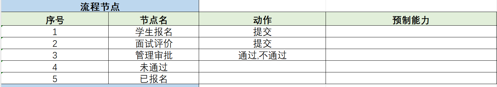

- **流程连线**

流程连线主要需要描述各个节点之间的流转关系，我们很容易想到，是通过动作（按钮）的触发，从而达到流转的效果。同样是前述的例子，当"学生报名”节点的学生点击"提交”的时候，我们希望它进入到"面试评价”节点，"管理审批”节点点击"通过”的时候，我们希望它达到"已报名”，反之为"未通过”。

基于这个逻辑，我们可以如下图进行编写。

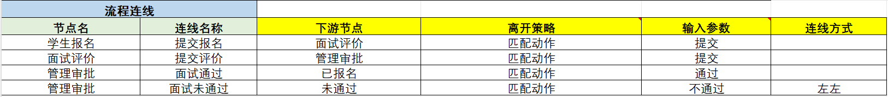

我们可以用语言对其进行描述。

当老师在"学生报名”节点填完信息后并点击了"提交”按钮，系统列出了以"学生报名”为起点的所有流程连线，首先看**离开策略**和**输入参数**是否匹配，如果匹配则视为匹配成功，可进入该连线指定的**下游节点**。如图中所示，连线"提交报名”的**离开策略**是**匹配动作**，而参数是"提交”，因此与我们实际上点击的按钮是匹配的，所以系统可以得知，该业务流程的下游节点是"面试评价”。

该流程的图形表达见于下图：

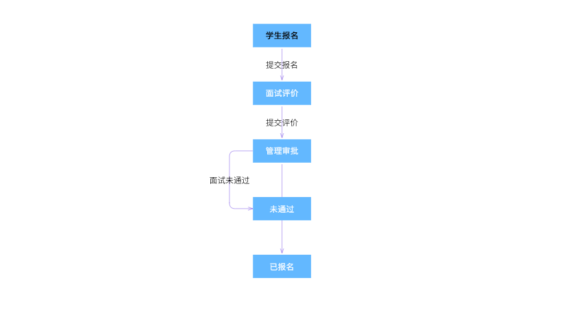

从上图你可以观察到，"管理审批”节点的"面试未通过”连线的"连线方式”填写的"左左”，其含义是它与他的下游节点的两个左边的边进行连接，如果是"左右”，则是管理审批节点的左边和未通过的右边进行连接。

### 3.2、数据模型

主要分为两个部分：

- **数据模型清单**，填写你的业务流程可能会用到哪些数据模型，相对通用的模型我们可以单独拆分各个小的数据模型，而如果相对独立，我们可以为这条业务流程单独设计一个。
- **数据项标准**，完整的描述出，当前的业务流程涉及多少个数据项，并编写清楚在不同节点下的状态。

参考例子见下图：

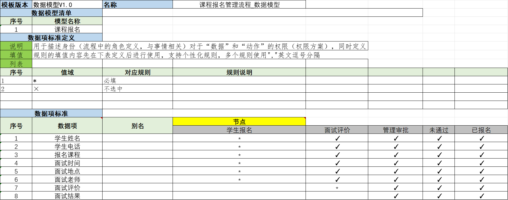

其中，描述各个数据项在不同节点下状态，目前只是记录其是否必填，即某个数据项在某个节点下是否必填，但其实该项功能可能与“权限矩阵”相互重叠，后续可能会移除该项功能。

### 3.3、动作定义

动作定义主要描述了在各个节点下可以触发什么动作，通过前述内容，我们可以了解到所谓动作可以直接指代为一些执行了定制化操作的代码，那么其实这里要描述的事物是：**在某个节点下，我想要做些什么？**

为了实现上述目的，一般需要填写两块内容：

- **节点动作**

该项共分为六列：节点名、动作名、动作规则、动作流、动作模型、触发时机。此六项无非是定义是哪个节点，执行哪个动作。其中动作规则目前很少使用，暂且不表，而**动作流和动作模型的主要区别是动作流可以组合多个动作模型以串行的方式逐个执行**，反过来说，动作模型只是作为一个只有一个动作模型的动作流。

此后，**触发时机一共有三种：交互、开始、结束**，前者声明该动作在该节点触发某个动作（按钮）的时候进行执行，后两个是在该节点的开始和结束的时候执行，也就是对应着流程节点的进入和退出！

举例说明。

1. 当课程报名流转到“管理审批”节点的一瞬间，此时这条流程会去查找当前节点名有没有触发时机为“开始”，且动作名为“start”的动作，存在则执行。
2. 当管理人员打开业务流程并点击“通过”的时候，会查找触发时机为“交互”，且动作名为“通过”的动作，存在则执行。
3. 当课程报名流转从“管理审批”节点要流转到下一个节点的一瞬间，此时这条流程会去查找当前节点名有没有触发时机为“结束”，且动作名为“finish”的动作，存在则执行。

- **动作列表**

描述同一个动作流的前后顺序，比较简单。其中动作模型可为空，后续在实际配置动作的时候会具体解释。

总的示例如下：

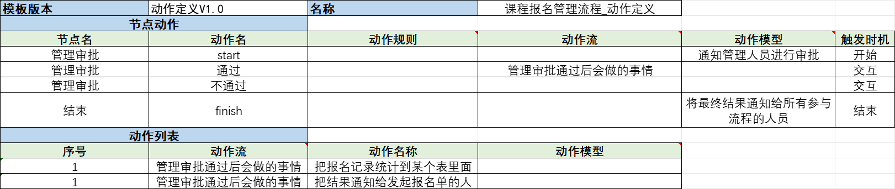

### 3.4、权限矩阵

权限矩阵，如其名，主要描述的事物是：

**什么人在什么节点下有什么权限。**

**什么人需要描述什么规则成立的情况下具备什么身份。**

**权限分为能看什么不能看什么、能写什么不能写什么、能点（按钮）什么不能点什么。**

总的来说，需要填写的信息分为两块：

#### 3.4.1、权限定义

> [!CAUTION]
>
> “权限定义”在表格中名为“权限矩阵”，为了不造成对标题的混淆，因此此处先称其为“权限定义”。

**分为五列，除去描述归属于哪个节点的“节点名”外，可以分为两个部分：什么人（身份）、什么权限。**

那么先谈“什么人”。

1. 身份。一种标识，可以是自定义或内置，自定义身份需要在“系统设置 > 身份管理”中进行配置。
2. 用户匹配规则。通过一种规则判断用户是否匹配，比如这里填写“指定范围('/培训学校/管理员')”，其含义就是，如果这个人具备管理员的角色，则视为匹配成功，而这个路径可以参考：*1、创建工作空间*中提到的组织模型。

**其中“用户匹配规则”，想要查看系统内置的规则以及自行编写规则，可见于“系统设置 > 规则管理 > 用户匹配规则”。**

其次便是“什么权限”，那其实对应着两列“数据”和“动作”，其实如其名，含义是使用什么数据的权限方案，以及什么动作的权限方案，组成部分是“权限方案名（对应的节点）”。即，**当前面的身份匹配成功后，会去寻找名为这里定义的权限方案，然后找到对应节点对应的具体的权限定义。**

参考示例如下：

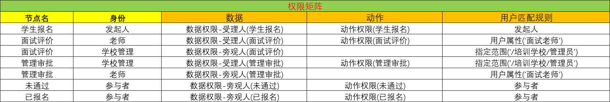

#### 3.4.2、权限方案

较于权限定义，这里就比较简单了，就是描述各个数据项在不同分类（节点）下对应的权限了，可直接参考实例。

其中，R可读、W可写、X可执行。具体见下图：

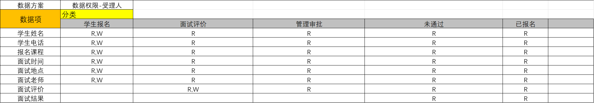

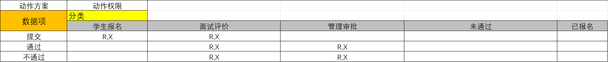

### 3.5、发布流程

**当前述工作全部完成，可在“业务组织 > 流程组装”中进行导入导出以及生效的工作。如果想要具体的界面进行展示，还需要单独配置视图，其中视图配置的“数据来源”为本业务流程的中文名，视图配置可见：*2、增加一个视图*。**

如果导入的过程中存在“运行出错”，则代表Excel填写有误，可点击红框所指区域进行判断，如果无法判断，请单击红框后展示的错误内容复制并发送给相关技术人员。

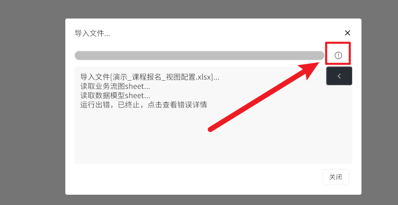

## 4、文档任务

本文档随之衍生“两日任务”，也就是根据本文档需要做出的成果。

### 4.1、第一天 构建视图

根据文档，构建出视图并进行配置，至少接触：应用发布、样式定义、表单布局。

### 4.2、第二天 构建流程

把业务流程整个跑出来，包括多角色协作，以及把视图的样式、布局，都调整好。

- **多角色协作**

一个人发起一条流程，管理层决定是否审批，同意或不同意，最后结束

- **调整视图**

表单尽可能丰富，布局要调整相对合适，不使用默认布局

### 4.3、实践中的Q&A

> [!NOTE]
>
> 在进行任务的过程中，将会遇到各种稀奇古怪的问题，因此这里汇总过往实习生曾经提出的问题，进行一个简单的总览。

**Q：视图配置表单这里，数据来源填写的是数据模型的中文名称是吗？**

A：是的

**Q：插件是否支持 idea？那我们可以用idea进行gpf那种方式的开发吗？**

A：插件不支持idea，目前只适配了Eclipse，但插件本身的主要作用仅为管理当前的工程（类似Git），具体用户使用什么IDE进行代码编写无所谓。

**Q：是否有开发所需的依赖 maven 坐标？要完成toast 功能，我们得需要依赖的 jar 包吧**

A：jar包是系统进行维护的，不用管，GPF客户端中有自研的一套云仓库体系，当需要引入外部的开源项目（MAVEN依赖）的时候，联系相关人员，可将其下载到云仓库，然后和业务系统的工程相绑定。

**Q：我发现关联类型在应用中显示是一种UUID，我如何指定，让其显示被关联模型的某一个属性？**

A：软件制造 ->表单属性样式（还有“电脑端表格样式”，表单上的样式和表格上的样式相独立，可能需要配置两次）；模板导入JIT并生效后，会自动创建样式，然后你需要设置类型为关联，之后在【显示扩展】设置显示扩展为【关联列表】，然后设置显示属性。

