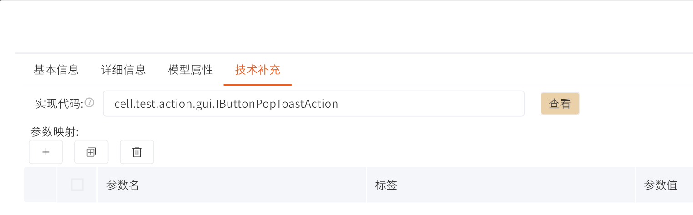

## 目录

[TOC]


## 0、常见 Q&A

**Q：本文档的组成部分？**

A：①讲述：如何管理Java工程。②讲述：如何将代码与视图(业务流程)相绑定。

**Q：为了开发动作，我需要在什么平台进行？**

A：①基于GPF客户端（或Eclipse插件BapDeveloper_Debug_1.X.X.jar）进行Java代码的提交及发布。②在JIT中将对应的代码与视图或业务流程对应起来。

## 1、JAVA工程管理

> [!WARNING]
>
> 无论是使用GPF客户端进行管理，抑或基于Eclipse插件，都需要本地环境具备以下要求：
>
> - Windows 7及以上
>
> - JDK 1.8
>
> 自行检查环境是否满足条件，如不满足，请自行查阅资料进行处理。


### 1.1 基于GPF客户端

#### 1.1.1、启动

首先，GPF的客户端与服务端是一体的，文件压缩包名字一般是“**GPF_X.X.X**”，如果正常，你会看到如下图所示的文件目录，如：bin、conf、lib、lib_ui、webapps...等目录。如果没有，请联系跬笃的负责人员。


确定已经存在GPF的客户端之后，**进入目录"\bin"，并双击文件“startGui.bat”启动GPF客户端。**

见到下图“BUSINESS APPLICATION”即为启动成功，需要分别填写三项：

- 服务地址，使用WebSocket协议，地址格式为："ws://ip:port"，后面会提供一种查看方式，如果依然无法登录，请联系对应的负责人员。
- 用户名，一般默认为**root**，如有变更，请联系对应的负责人员。
- 密码，一般默认为**public**，如有变更，请联系对应的负责人员。


其中，WebSocket协议是GPF客户端与GPF服务端的通讯方式，我们运行的业务系统也不例外，因此可以使用浏览器的开发者工具查看业务系统对应的服务端地址。

一般在对应的业务系统按下键盘的F12键，即可展示开发者工具，如无法激活，

请自行检索：“我所使用的xx浏览器，如何打开开发者工具”。

如果一切正常，可看到下面界面，同时，当上方标签页切换到“网络”的时候，可以观察到当前业务系统所请求的网络信息，其中有一条类型为“websocket”的地址，我们可以单击查看详细情况。

（如果网络数据没有出现，请在保持开发者工具打开的状态进行刷新页面。）


单击后可知当前业务系统对应的服务地址，填入GPF客户端即可（服务地址格式为:ws://ip:port，因此注意端口后面的左斜杠要去除）。


如一切正常，可以看到下图所示的工程管理界面，可以在此管理当前GPF平台中的所有Java工程。


#### 1.1.2、开发

如果需要新建工程，则在顶部的“Java Project”右键，并点击“New Project”，一般工程名规范为“gpf_dc_项目名”。


创建后单击项目，并右键，将项目的“Depend Type”改为“Depend Plugin”。


我们将创建一个**填值规则**的代码在工程中，目标是创建一个填值规则，在流程提交后，自动将流程的创建者的姓名写入到流程的“发起人”字段中。

首先，右键工程下的“CORE”目录，单击“NEW CLASS”


**输入类名，及包名，其中包名根据规范，表达式的包名为“工程名.expression”**。


具体代码见下图。


#### 1.1.3、发布

当代码编写完毕后，Ctrl+S进行保存，其后右键工程，点击“Global Publish Plugin”进行发布代码。

（关于**1.1.2、开发**编写的填制代码，具体的配置方法见**2.1、填值规则的配置**。）


### 1.2、基于Eclipse插件

#### 1.2.1、启动

首先确保你的Eclipse中存在BapDeveloper插件，如果你没有这个插件，请联系相关负责人员索要。


如果一切正常，可在Eclipse的菜单栏中看到“Bap Development”


首次使用，单击“Checkout Project”，可进入“BUSINES APPLICATION”, 登录方式与**1.1.1、启动**等同，这里不再赘述。

进入后，可点击“NEW PROJECT”按钮创建新项目，与**1.1.2、开发**等同，

另外可以将项目工程拉到本地，具体步骤如下：

1. 勾选“core”文件夹
2. 点击“Browser”选择一个本地的文件夹
3. 单击Checkout Project

之后等待片刻，即可将工程代码拉入到本地，之后将工程载入到Eclipse的WorkSpaces即可。


#### 1.2.2、开发&发布

工程载入到Eclipse之后，单击右键可以见下列操作：

- Code Explorer 代码的更新与提交（Update or Commit）
- Download Library（Difference or Fully），更新系统的资源，如GPF的Basic包或其他依赖工程更新后，需要使用这个功能更新本地的依赖Jar包。
- Administrator Tool，GPF客户端，与**1.1.3、发布**等同。
- Global Publish Online，发布代码，与**1.1.3、发布**等同。


当本地工程更新后，使用Code Explorer工具刷新对应的目录，对比与服务器的代码，可选择：

- Update：将服务器上的代码更新到本地
- Commit：将本地的代码更新到服务器


## 2、JIT配置

### 2.1、规则配置

以“填值规则”为例，其他规则等同或类似。

**进入联合迭代工具(JIT) -> 系统设置 ->  动作管理 ->  规则管理 ->  填值规则**

必须配置：

- 编号
- 代码路径

为了规范性和通用性，也要配置其他参数：

- 适用范围
- 参数说明
- ...


下图为动作规则中的应用。


### 2.2、动作模型配置

以“单击按钮并弹出提示框”为例，其他（如流程动作）等同或类似。

#### 2.2.1、代码

在Java工程中编写下述代码，调用PopToast.success()方法，向页面传输一个弹出提示框(Toast，吐司)。

编写完毕后，使用Code Explorer工具将对应的代码提交(Commit)到服务器，并发布代码(Global Publish Online)。

```java
package cell.test.action.gui;

import cell.CellIntf;
import fe.cmn.app.ability.PopToast;
import fe.cmn.panel.PanelContext;
import gpf.dc.action.intf.BaseActionIntf;
import gpf.dc.basic.param.view.BaseFeActionParameter;

public interface IButtonPopToastAction<T extends BaseFeActionParameter> extends CellIntf, BaseActionIntf<T> {
    @Override
    default Object execute(T input) throws Exception {
        PanelContext panelContext = input.getPanelContext();
        PopToast.success(panelContext.getChannel(), "你单击了按钮！");

        return null;
    }

    @Override
    default Class<? extends T> getInputParamClass() {
        return (Class<? extends T>) BaseFeActionParameter.class;
    }

}

```

#### 2.2.2、配置

**进入联合迭代工具(JIT) -> 要素梳理->  动作模型**

在“工作空间_动作模型”根节点下，新增一个动作模型，见下图。

（实际开发中应注意动作模型的分类）

必要的参数有：

- (基础信息) 动作名称
- (技术补充) 实现代码，填写**2.2.1、代码**中的类全路径。

本文档只是为了演示，省略了多个参数，实际开发中应补全。




提交后，选择根目录，并单击“批量生效”。


#### 2.2.3、使用

为了使用，在想要配置的视图配置中增加一个按钮“弹出提示框”，并指定动作模型为**2.2.2、配置**中编写的动作名称“按钮弹出提示”。

具体配置见下图。其语义为：**在表格行操作栏添加一个按钮，名为“弹出提示框”，按钮[弹出提示框]单击后会触发一个动作，名为“弹出提示框”，而动作[弹出提示框]，会触发动作模型“按钮弹出提示”，**

此动作模型[按钮弹出提示]便是**2.2.2、配置**所配置的动作，也就是说按钮单击后会触发对应实现代码。


效果见下图。


注意，如果动作模型本身携带参数需要进行配置，则单击视图配置最右侧小人图标(语义为Action,动作)，找对对应的**动作实例**进行配置。步骤如下：

1. 查看当前关联的动作实例


2. 找到你想要编辑的动作实例


3. 不同的视图，选择你想要配置的。（一个视图配置对应多个视图，如PC端表格、PC端表单、移动端..，因此需要单独选择进行配置）。


4. 进行配置（注意：这里演示的动作没有参数需要配置）。


## 3、工程实践
